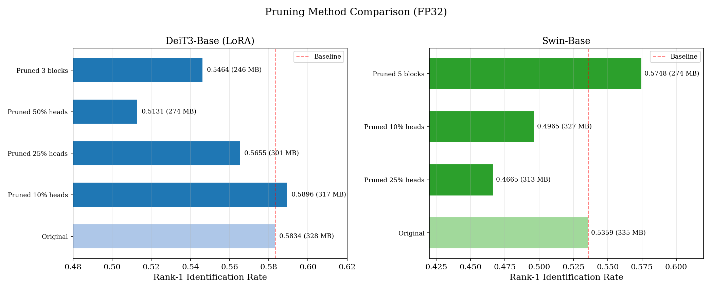
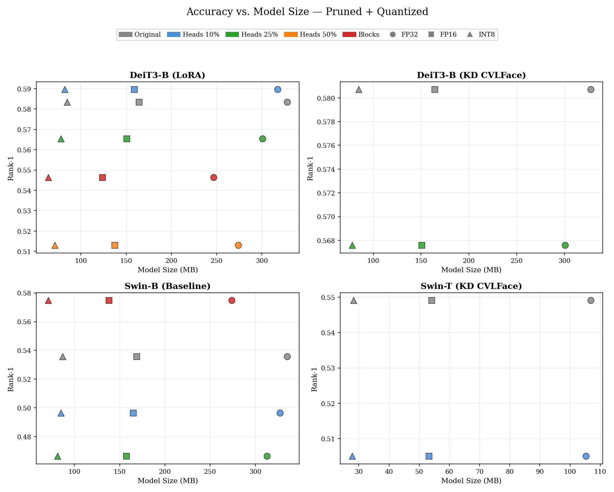
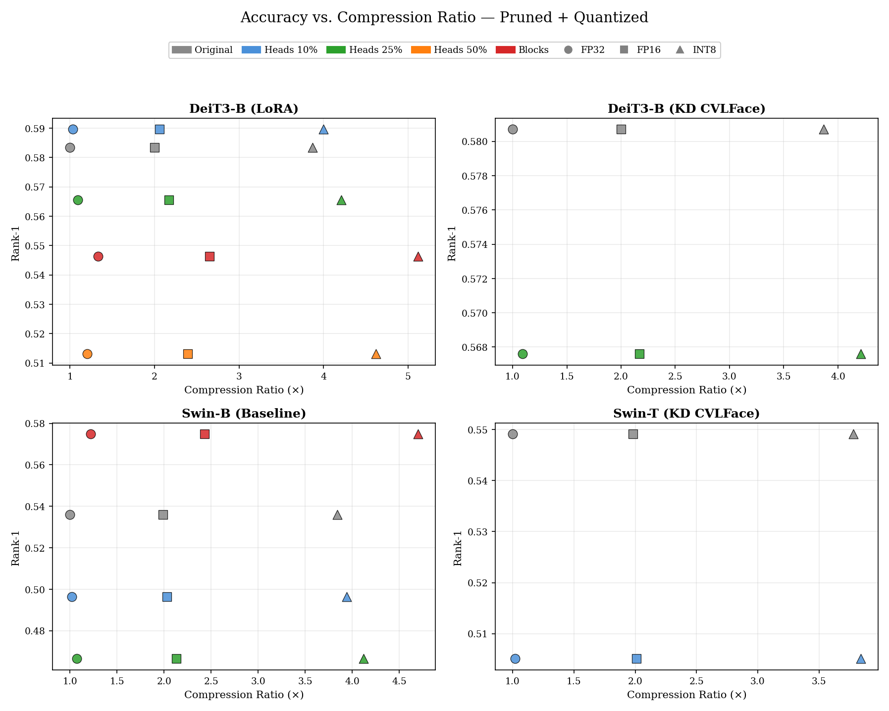
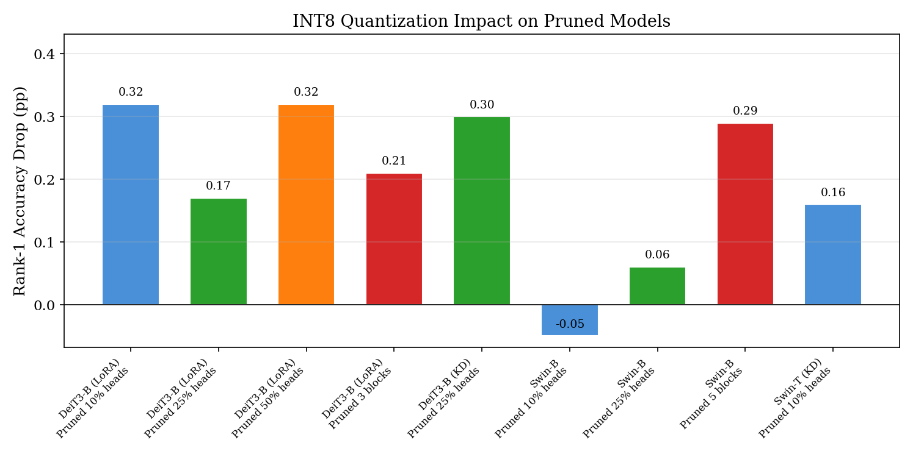

# Structured Pruning Results

## Overview

Structured pruning was applied to four base models using two strategies:

- **Attention head pruning** — remove entire MHSA heads by magnitude importance, then resize QKV/proj tensors
- **Block dropping** — remove whole encoder blocks (last-first ordering), reducing model depth

All pruned models were fine-tuned for 10 epochs (AdamW, lr=3e-5, cosine annealing) and evaluated on the TinyFace TEST set. All 27 pruned + quantized ONNX variants (9 models × 3 precisions) were independently evaluated, confirming that FP16 is lossless while INT8 introduces small but measurable drops.

## Source Models

| Model | Variant | Params (M) | Baseline rank@1 |
|-------|---------|------------|-----------------|
| deit3_base_patch16_224 | LoRA | 85.8 | 0.5834 |
| deit3_base_patch16_224 | KD CVLFace | 85.8 | 0.5807 |
| swin_base_patch4_window7_224 | baseline | 86.7 | 0.5359 |
| swin_tiny_patch4_window7_224 | KD CVLFace | 27.5 | 0.5491 |

## Pruning Results (TEST Set, PyTorch)

| Experiment | Method | Params Before | Params After | Reduction | rank@1 | Drop |
|------------|--------|--------------|-------------|-----------|--------|------|
| deit3_base (LoRA) | Heads 10% | 87.5M | 84.7M | 3.1% | **0.5896** | **−0.62 pp** |
| deit3_base (LoRA) | Heads 25% | 87.5M | 80.4M | 8.1% | 0.5655 | +1.79 pp |
| deit3_base (LoRA) | Heads 50% | 87.5M | 73.3M | 16.2% | 0.5131 | +7.03 pp |
| deit3_base (LoRA) | Blocks 3/12 | 87.5M | 66.2M | 24.3% | 0.5464 | +3.70 pp |
| deit3_base (KD CVLFace) | Heads 25% | 87.5M | 80.4M | 8.1% | 0.5676 | +1.31 pp |
| swin_base | Heads 10% | 89.1M | 84.7M | 4.9% | 0.4965 | +3.94 pp |
| swin_base | Heads 25% | 89.1M | 83.4M | 6.4% | 0.4665 | +6.94 pp |
| swin_base | Blocks 5/18 | 89.1M | 73.3M | 17.7% | **0.5748** | **−3.89 pp** |
| swin_tiny (KD CVLFace) | Heads 10% | 29.3M | 28.9M | 1.4% | 0.5051 | +4.40 pp |

Negative drop = accuracy improved after pruning + fine-tuning.

## Accuracy vs. Compression (ONNX, Measured per Precision)

All rank@1 values below were independently measured on the TinyFace TEST set using ONNX Runtime inference. FP32 ONNX models were validated to match PyTorch exactly (0.0000 difference across all 9 models).

### DeiT3-Base (LoRA)

| Method | Params (M) | Size (MB) | Compression | rank@1 | Drop vs baseline |
|--------|-----------|-----------|-------------|--------|------------------|
| Original FP32 | 85.8 | 327.7 | 1.00× | 0.5834 | — |
| Original FP16 | 85.8 | 164.2 | 2.00× | 0.5834 | — |
| Original INT8 | 85.8 | 84.6 | 3.87× | 0.5834 | — |
| Pruned 10% heads FP32 | 84.7 | 317.2 | 1.03× | **0.5896** | **−0.62 pp** |
| Pruned 10% heads FP16 | 84.7 | 158.9 | 2.06× | **0.5896** | **−0.62 pp** |
| Pruned 10% heads INT8 | 84.7 | 82.0 | 4.00× | 0.5864 | −0.30 pp |
| Pruned 25% heads FP32 | 80.4 | 300.6 | 1.09× | 0.5655 | +1.79 pp |
| Pruned 25% heads FP16 | 80.4 | 150.7 | 2.17× | 0.5655 | +1.79 pp |
| Pruned 25% heads INT8 | 80.4 | 77.8 | 4.21× | 0.5638 | +1.96 pp |
| Pruned 50% heads FP32 | 73.3 | 273.6 | 1.20× | 0.5131 | +7.03 pp |
| Pruned 50% heads FP16 | 73.3 | 137.1 | 2.39× | 0.5131 | +7.03 pp |
| Pruned 50% heads INT8 | 73.3 | 71.0 | 4.62× | 0.5099 | +7.35 pp |
| Pruned 3 blocks FP32 | 66.2 | 246.4 | 1.33× | 0.5464 | +3.70 pp |
| Pruned 3 blocks FP16 | 66.2 | 123.5 | 2.65× | 0.5464 | +3.70 pp |
| Pruned 3 blocks INT8 | 66.2 | 64.0 | **5.12×** | 0.5443 | +3.91 pp |

### DeiT3-Base (KD CVLFace)

| Method | Params (M) | Size (MB) | Compression | rank@1 | Drop vs baseline |
|--------|-----------|-----------|-------------|--------|------------------|
| Original FP32 | 85.8 | 327.7 | 1.00× | 0.5807 | — |
| Original FP16 | 85.8 | 164.2 | 2.00× | 0.5807 | — |
| Original INT8 | 85.8 | 84.6 | 3.87× | 0.5807 | — |
| Pruned 25% heads FP32 | 80.4 | 300.6 | 1.09× | 0.5676 | +1.31 pp |
| Pruned 25% heads FP16 | 80.4 | 150.7 | 2.17× | 0.5679 | +1.28 pp |
| Pruned 25% heads INT8 | 80.4 | 77.8 | 4.21× | 0.5646 | +1.61 pp |

### Swin-Base

| Method | Params (M) | Size (MB) | Compression | rank@1 | Drop vs baseline |
|--------|-----------|-----------|-------------|--------|------------------|
| Original FP32 | 86.7 | 334.9 | 1.00× | 0.5359 | — |
| Original FP16 | 86.7 | 168.6 | 1.99× | 0.5359 | — |
| Original INT8 | 86.7 | 87.2 | 3.84× | 0.5359 | — |
| Pruned 10% heads FP32 | 84.7 | 327.2 | 1.02× | 0.4965 | +3.94 pp |
| Pruned 10% heads FP16 | 84.7 | 164.8 | 2.03× | 0.4968 | +3.91 pp |
| Pruned 10% heads INT8 | 84.7 | 85.1 | 3.94× | 0.4970 | +3.89 pp |
| Pruned 25% heads FP32 | 83.4 | 312.6 | 1.07× | 0.4665 | +6.94 pp |
| Pruned 25% heads FP16 | 83.4 | 157.5 | 2.13× | 0.4662 | +6.97 pp |
| Pruned 25% heads INT8 | 83.4 | 81.2 | 4.12× | 0.4659 | +7.00 pp |
| Pruned 5 blocks FP32 | 73.3 | 273.9 | 1.22× | **0.5748** | **−3.89 pp** |
| Pruned 5 blocks FP16 | 73.3 | 137.9 | 2.43× | **0.5748** | **−3.89 pp** |
| Pruned 5 blocks INT8 | 73.3 | 71.2 | **4.70×** | 0.5719 | −3.60 pp |

### Swin-Tiny (KD CVLFace)

| Method | Params (M) | Size (MB) | Compression | rank@1 | Drop vs baseline |
|--------|-----------|-----------|-------------|--------|------------------|
| Original FP32 | 27.5 | 106.9 | 1.00× | 0.5491 | — |
| Original FP16 | 27.5 | 54.1 | 1.98× | 0.5491 | — |
| Original INT8 | 27.5 | 28.3 | 3.78× | 0.5491 | — |
| Pruned 10% heads FP32 | 28.9 | 105.3 | 1.02× | 0.5051 | +4.40 pp |
| Pruned 10% heads FP16 | 28.9 | 53.2 | 2.01× | 0.5048 | +4.43 pp |
| Pruned 10% heads INT8 | 28.9 | 27.8 | 3.84× | 0.5035 | +4.56 pp |

## INT8 Quantization Impact on Pruned Models

Each pruned model was evaluated at FP32, FP16 and INT8. FP16 is functionally lossless (≤0.0003 rank@1 difference). INT8 introduces small but consistent drops:

| Pruned Model | FP32 rank@1 | INT8 rank@1 | INT8 Drop (pp) |
|-------------|------------|------------|----------------|
| DeiT3-Base (LoRA) 10% heads | 0.5896 | 0.5864 | 0.32 |
| DeiT3-Base (LoRA) 25% heads | 0.5655 | 0.5638 | 0.17 |
| DeiT3-Base (LoRA) 50% heads | 0.5131 | 0.5099 | 0.32 |
| DeiT3-Base (LoRA) 3 blocks | 0.5464 | 0.5443 | 0.21 |
| DeiT3-Base (KD) 25% heads | 0.5676 | 0.5646 | 0.30 |
| Swin-Base 10% heads | 0.4965 | 0.4970 | −0.05 |
| Swin-Base 25% heads | 0.4665 | 0.4659 | 0.06 |
| Swin-Base 5 blocks | 0.5748 | 0.5719 | 0.29 |
| Swin-Tiny (KD) 10% heads | 0.5051 | 0.5035 | 0.16 |

Mean INT8 drop: **0.20 pp** (range −0.05 to 0.32 pp). This is consistent with INT8 drops on non-pruned models (0.10–0.20 pp), confirming that **pruned architectures are no more sensitive to quantization noise** than unpruned ones. Notably, Swin-Base with 10% head pruning shows a marginal INT8 *improvement* (−0.05 pp).

## Full Evaluation Metrics (All Precisions)

All 27 pruned + quantized models were evaluated with the full metric suite: rank@1–5, AUC, mAP, EER, and TPR at fixed FPR thresholds.

### DeiT3-Base Models

| Model | Precision | rank@1 | AUC | mAP | EER | TPR@FPR=1% | TPR@FPR=5% |
|-------|-----------|--------|-----|-----|-----|------------|------------|
| LoRA 10% heads | FP32 | 0.5896 | 0.9734 | 0.6428 | 0.0778 | 0.8095 | 0.9021 |
| LoRA 10% heads | FP16 | 0.5896 | 0.9734 | 0.6428 | 0.0778 | 0.8098 | 0.9026 |
| LoRA 10% heads | INT8 | 0.5864 | 0.9729 | 0.6402 | 0.0791 | 0.8063 | 0.8999 |
| LoRA 25% heads | FP32 | 0.5655 | 0.9704 | 0.6229 | 0.0810 | 0.7913 | 0.8938 |
| LoRA 25% heads | FP16 | 0.5655 | 0.9704 | 0.6229 | 0.0808 | 0.7913 | 0.8938 |
| LoRA 25% heads | INT8 | 0.5638 | 0.9698 | 0.6211 | 0.0826 | 0.7881 | 0.8927 |
| LoRA 50% heads | FP32 | 0.5131 | 0.9638 | 0.5733 | 0.0944 | 0.7567 | 0.8613 |
| LoRA 50% heads | FP16 | 0.5131 | 0.9638 | 0.5733 | 0.0944 | 0.7570 | 0.8611 |
| LoRA 50% heads | INT8 | 0.5099 | 0.9634 | 0.5704 | 0.0950 | 0.7567 | 0.8592 |
| LoRA 3 blocks | FP32 | 0.5464 | 0.9665 | 0.5987 | 0.0898 | 0.7607 | 0.8782 |
| LoRA 3 blocks | FP16 | 0.5464 | 0.9665 | 0.5987 | 0.0899 | 0.7602 | 0.8782 |
| LoRA 3 blocks | INT8 | 0.5443 | 0.9663 | 0.5974 | 0.0889 | 0.7586 | 0.8777 |
| KD 25% heads | FP32 | 0.5676 | 0.9705 | 0.6231 | 0.0853 | 0.7959 | 0.8844 |
| KD 25% heads | FP16 | 0.5679 | 0.9705 | 0.6234 | 0.0853 | 0.7959 | 0.8844 |
| KD 25% heads | INT8 | 0.5646 | 0.9696 | 0.6199 | 0.0877 | 0.7929 | 0.8841 |

### Swin Models

| Model | Precision | rank@1 | AUC | mAP | EER | TPR@FPR=1% | TPR@FPR=5% |
|-------|-----------|--------|-----|-----|-----|------------|------------|
| Base 10% heads | FP32 | 0.4965 | 0.9519 | 0.5582 | 0.1102 | 0.7286 | 0.8458 |
| Base 10% heads | FP16 | 0.4968 | 0.9519 | 0.5584 | 0.1102 | 0.7286 | 0.8458 |
| Base 10% heads | INT8 | 0.4970 | 0.9518 | 0.5579 | 0.1108 | 0.7268 | 0.8444 |
| Base 25% heads | FP32 | 0.4665 | 0.9456 | 0.5282 | 0.1202 | 0.7079 | 0.8200 |
| Base 25% heads | FP16 | 0.4662 | 0.9456 | 0.5281 | 0.1202 | 0.7071 | 0.8200 |
| Base 25% heads | INT8 | 0.4659 | 0.9455 | 0.5271 | 0.1210 | 0.7060 | 0.8168 |
| Base 5 blocks | FP32 | 0.5748 | 0.9678 | 0.6290 | 0.0869 | 0.7924 | 0.8841 |
| Base 5 blocks | FP16 | 0.5748 | 0.9678 | 0.6290 | 0.0869 | 0.7929 | 0.8841 |
| Base 5 blocks | INT8 | 0.5719 | 0.9680 | 0.6284 | 0.0874 | 0.7910 | 0.8849 |
| Tiny (KD) 10% heads | FP32 | 0.5051 | 0.9616 | 0.5663 | 0.0968 | 0.7444 | 0.8570 |
| Tiny (KD) 10% heads | FP16 | 0.5048 | 0.9615 | 0.5662 | 0.0971 | 0.7436 | 0.8568 |
| Tiny (KD) 10% heads | INT8 | 0.5035 | 0.9619 | 0.5653 | 0.0979 | 0.7428 | 0.8573 |

## Key Findings

1. **Mild head pruning can improve accuracy.** DeiT3-Base with 10% head pruning achieved 0.5896 rank@1, surpassing the unpruned baseline (0.5834) by 0.62 pp. This suggests a regularization effect from removing redundant attention heads.

2. **Block dropping is highly effective for Swin.** Removing 5 of 18 blocks from Swin-Base *improved* accuracy by 3.89 pp (0.5748 vs 0.5359) while achieving 17.7% parameter reduction. Combined with INT8 quantization, this yields 4.70× compression with rank@1 = 0.5719 — still 3.60 pp above the unpruned baseline.

3. **DeiT3 tolerates head pruning better than Swin.** At 25% head removal, DeiT3 drops only 1.79 pp while Swin drops 6.94 pp. Even at 10% head removal, Swin-B drops 3.94 pp (rank@1 = 0.4965) while DeiT3-B *improves* by 0.62 pp. DeiT3's uniform block structure may make its heads more independently valuable, whereas Swin's hierarchical window attention is sensitive to head removal at any ratio.

4. **Aggressive pruning (50% heads) degrades significantly.** DeiT3 with 50% heads removed loses 7.03 pp, indicating a practical ceiling around 25% for head pruning.

5. **KD + pruning stacks.** DeiT3-Base (KD CVLFace) with 25% head pruning retains 0.5676 rank@1 — a drop of only 1.31 pp from its KD baseline. The KD-trained model is slightly more robust to pruning than the LoRA variant at the same ratio (1.31 pp vs 1.79 pp drop).

6. **FP16 is lossless; INT8 introduces small uniform drops.** Across all 9 pruned models, FP16 matches FP32 within ±0.0003 rank@1. INT8 drops range from −0.05 to 0.32 pp (mean 0.20 pp), on par with INT8 drops on unpruned models. Pruning does **not** amplify quantization sensitivity.

7. **Maximum compression without accuracy loss.** Two configurations improve accuracy over their unpruned baselines:
   - DeiT3-Base 10% heads + INT8: **4.00× compression, +0.30 pp** (82 MB, rank@1 = 0.5864)
   - Swin-Base 5 blocks + INT8: **4.70× compression, +3.60 pp** (71.2 MB, rank@1 = 0.5719)

8. **Maximum compression overall.** DeiT3-Base 3 blocks + INT8 achieves **5.12× compression** (64 MB, down from 327.7 MB) with a 3.91 pp accuracy drop (rank@1 = 0.5443).
   - Swin-Base 5 blocks + INT8: **4.70× compression, +3.60 pp** (71.2 MB, rank@1 = 0.5719)

9. **Swin-B is uniformly sensitive to head pruning.** Even conservative 10% head removal degrades Swin-B by 3.94 pp, while 25% causes a 6.94 pp drop. This contrasts sharply with block dropping (+3.89 pp), confirming that Swin-B is over-parameterized in depth rather than width for TinyFace.

## Pipeline

- **Pruning**: `pruning.py` — head pruning (magnitude importance) and block dropping (last-first)
- **Fine-tuning**: 10 epochs, AdamW lr=3e-5, weight_decay=0.05, cosine annealing, all params unfrozen
- **ONNX export**: `export_pruned_onnx.py` — reconstructs pruned architecture, loads fine-tuned weights, validates output
- **Quantization**: FP16 (onnxconverter-common), INT8 dynamic (onnxruntime, weights-only)
- **Evaluation**: `eval_onnx.py --roc` — TinyFace TEST set, rank@1–5, AUC, mAP, EER, TPR@FPR=1%, TPR@FPR=5%

## Output Files

| File | Description |
|------|-------------|
| `pruning_results/pruning_summary.csv` | Per-experiment pruning results (params, rank@1, drop) |
| `pruning_results/compression_analysis.csv` | Full accuracy-vs-compression table (39 rows, measured values) |
| `pruning_results/pareto_data.csv` | Pareto-optimal plot data (39 rows) |
| `pruning_results/pruned_quantized_full_metrics.csv` | Full metrics for all 27 pruned+quantized variants |
| `pruning_results/generate_plots.py` | Script to regenerate all plots from CSVs |
| `onnx_models/pruned/*.onnx` | Pruned ONNX models (FP32) |
| `onnx_models_fp16/pruned/*.onnx` | Pruned + FP16 quantized |
| `onnx_models_int8/pruned/*.onnx` | Pruned + INT8 quantized |
